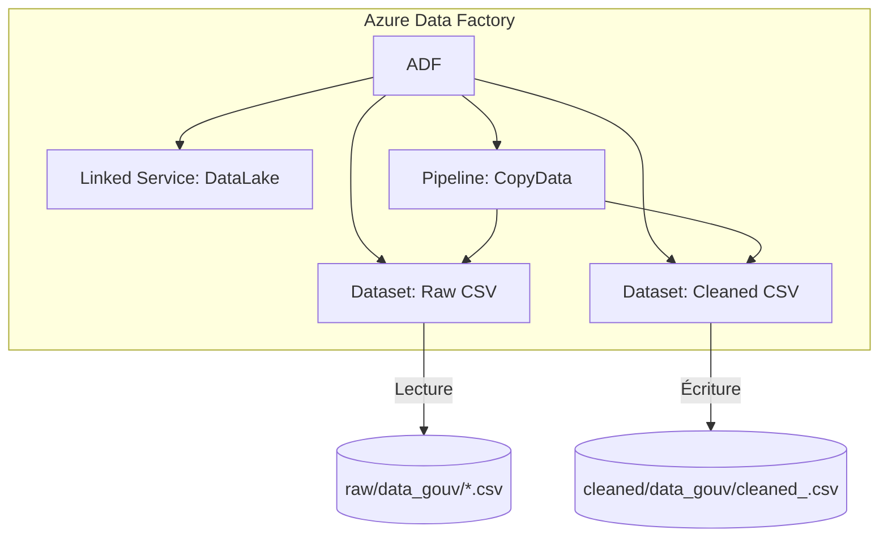

# education_data_hub

```mermaid	
graph TD
    subgraph Azure Data Factory
    ADF[ADF] --> LinkedService[Linked Service: DataLake]
    ADF --> Raw[Dataset: Raw CSV]
    ADF --> Cleaned[Dataset: Cleaned CSV]
    ADF --> Pipeline[Pipeline: CopyData]
    Pipeline --> Raw
    Pipeline --> Cleaned
    end

    Raw -->|Lecture| raw_data[(raw/data_gouv/*.csv)]
    Cleaned -->|Écriture| cleaned_data[(cleaned/data_gouv/cleaned_<timestamp>.csv)]
```

