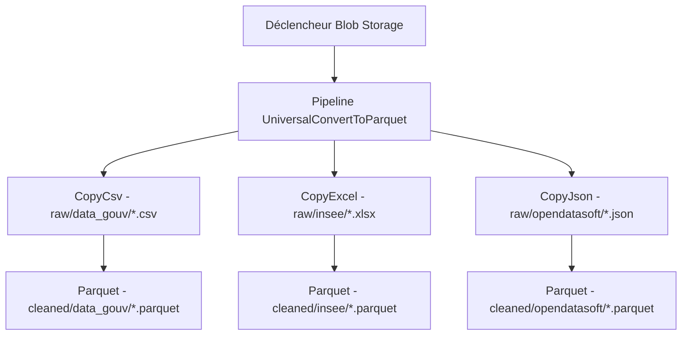

# Infrastructure Terraform pour OKOTWICA

Ce dossier contient la configuration Terraform pour déployer l'infrastructure Azure nécessaire au projet OKOTWICA.

## Architecture

L'infrastructure déployée comprend :
- Un Resource Group
- Un Storage Account (Data Lake Gen2)
- Trois containers de stockage :
  - `raw` : données brutes
  - `cleaned` : données nettoyées
  - `tables` : données transformées

## Prérequis

- Terraform installé (dernière version)
- Accès Azure avec les droits suffisants
- Variables d'environnement Azure configurées :
  - `ARM_CLIENT_ID`
  - `ARM_CLIENT_SECRET`
  - `ARM_SUBSCRIPTION_ID`
  - `ARM_TENANT_ID`

## Structure des fichiers

- `main.tf` : Configuration principale des ressources Azure
- `variables.tf` : Définition des variables
- `backend.tf` : Configuration du backend Terraform pour le stockage distant de l'état

## Configuration du Backend

L'état Terraform est stocké dans Azure Storage :
- Resource Group : `rg-terraform-state`
- Storage Account : `saterraformstateokotwica`
- Container : `tfstate`
- Fichier d'état : `prod.terraform.tfstate`

## Variables

| Nom | Description | Valeur par défaut |
|-----|-------------|-------------------|
| `resource_group_name` | Nom du Resource Group | `RG-OKOTWICA-Prod` |
| `location` | Région Azure | `francecentral` |
| `storage_account_name` | Nom du Storage Account | `sadatalakeokotwicaprod` |

## Workflow GitHub Actions

Le déploiement est automatisé via GitHub Actions avec les étapes suivantes :
1. Vérification du formatage
2. Initialisation de Terraform
3. Validation de la configuration
4. Plan d'exécution
5. Application des changements (uniquement sur main)

Le workflow ne déploie que si des modifications sont nécessaires.

## Utilisation locale

Pour appliquer les modifications locales :

```bash
terraform apply
```

## Diagramme du pipeline



## Sécurité

- Tous les containers sont configurés en accès privé
- L'authentification se fait via Service Principal
- L'état Terraform est stocké de manière sécurisée dans Azure

## Maintenance

Pour mettre à jour l'infrastructure :
1. Modifier les fichiers Terraform selon les besoins
2. Créer une Pull Request
3. Vérifier le plan d'exécution dans les Actions GitHub
4. Merger dans main pour appliquer les changements
